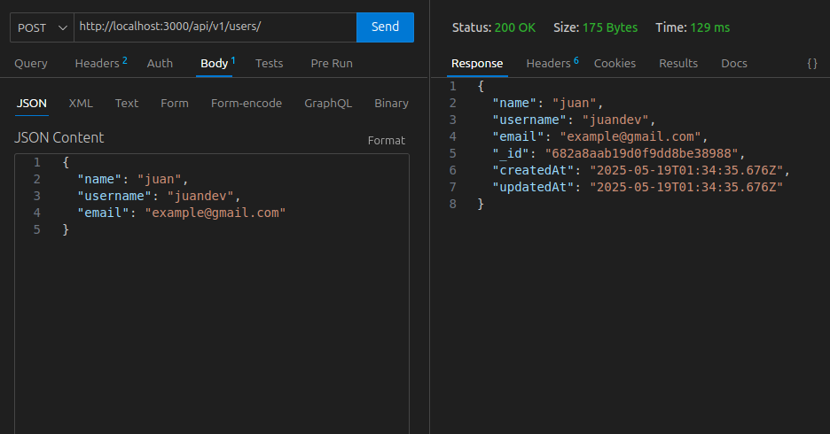
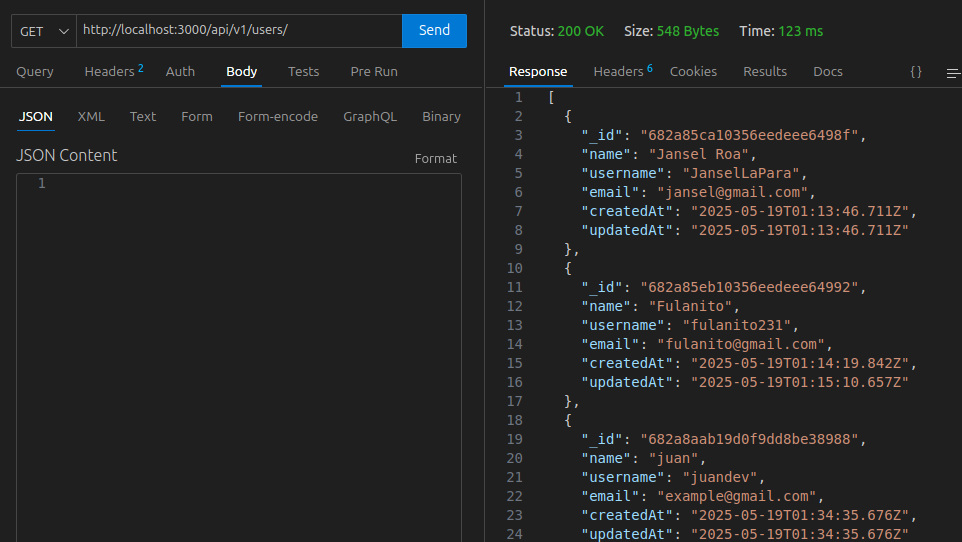

### CRUD with typescript, express and mongoDB
User API using the dependency injection method, with repositories, services, and others to perform CRUD operations, create, read, update, and delete
#### technologies:
#### Typescript, Express, MongoDB etc


```
https://github.com/ninjadev23/API-CRUD-TYPESCRIPT.git
```
```
npm install
```
```
npm run dev
```
or 
```
npm run start
```
